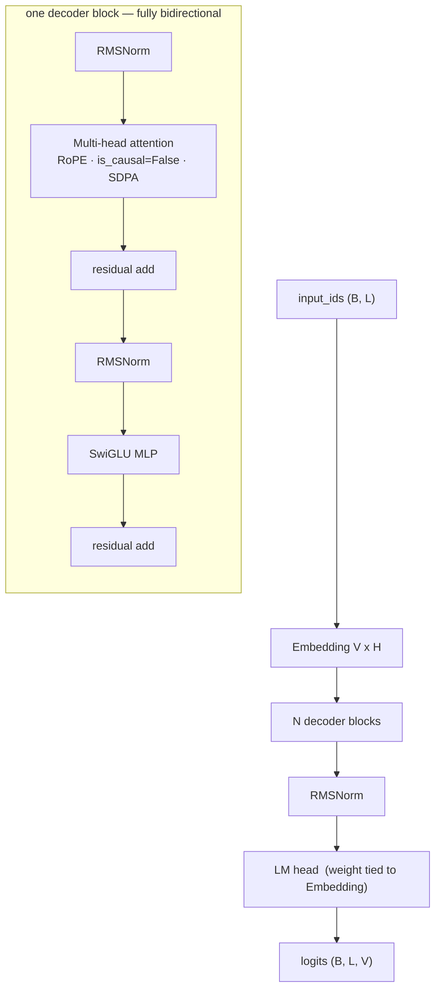
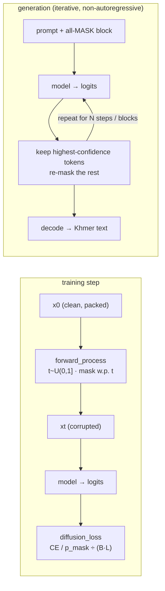

# Khmer-LLaDA-Small

A from-scratch **masked discrete diffusion language model for Khmer**, in the style of
[LLaDA](https://github.com/ML-GSAI/LLaDA), sized to train on a **single NVIDIA T4 (16 GB)**
— Kaggle / Colab friendly.

Text only. No audio, no ASR. The model reads Khmer text, learns to recover masked tokens under a
diffusion objective, and generates Khmer text non-autoregressively.

The research goal is a controlled comparison: **masked diffusion vs. autoregressive language
modelling for a low-resource language, at a fixed compute budget**, plus a tokenizer study and a
diffusion-steps study.

> Status: scaffold complete and CPU-smoke-tested (`pytest tests/` green; `train.py` runs end-to-end
> incl. resume). Not yet trained. See [`PLAN.md`](PLAN.md) for the full plan, milestones, and risks.

---

## Contents

- [Motivation](#motivation)
- [Architecture](#architecture)
- [The diffusion objective](#the-diffusion-objective)
- [Model sizes](#model-sizes)
- [Repository layout](#repository-layout)
- [Installation](#installation)
- [Usage](#usage)
- [Training on a T4](#training-on-a-t4)
- [Evaluation](#evaluation)
- [Experiments](#experiments)
- [Data & tokenizer](#data--tokenizer)
- [Design decisions](#design-decisions)
- [Roadmap](#roadmap)
- [Acknowledgements](#acknowledgements)
- [License](#license)

---

## Motivation

[LLaDA-8B](https://huggingface.co/GSAI-ML/LLaDA-8B-Base) showed that a **masked diffusion** LM can
match autoregressive LLMs at scale. It was trained from scratch and its pre-training framework was
not released. This project asks whether the paradigm is useful **under real constraints** — one
consumer GPU, a low-resource language (Khmer), and a small parameter budget — and whether it earns
its keep against a matched autoregressive baseline.

Khmer is a good stress test: no inter-word spaces, heavy use of stacked consonants (coeng) and
vowel reordering, organic code-switching with English, and scarce clean text.

---

## Architecture

A minimal LLaMA-style transformer with **bidirectional** attention (no causal mask), RoPE, RMSNorm,
and a SwiGLU MLP. Input/output embeddings are tied. Cross-checked against
`modeling_llada.py` from `GSAI-ML/LLaDA-8B-Base`.



- **No causal mask.** Every position attends to every other position — this is what separates a
  diffusion LM from a GPT-style decoder. `tests/test_bidirectional.py` asserts it (perturbing the
  last token must change the logits at position 0, and vice-versa).
- **RoPE** positional encoding (base 10 000) — extends cheaply from 512 to 1024 context later.
- **Packed sequences**, no padding: documents are concatenated with `<EOS>` and chunked to a fixed
  length, so the loss normalization stays exact.
- **`<MASK>`** is token id `4`, fixed by the `Panhapich/khmer-sp-8k` tokenizer.

Implementation: [`khmer_llada/modeling.py`](khmer_llada/modeling.py) (~130 lines).

---

## The diffusion objective

Not BERT (fixed mask ratio) and not next-token prediction. Per training example:

1. Sample a noise level `t ~ U(0, 1]` (clamped to `[1e-3, 1]`), one scalar per sequence.
2. Mask each token independently with probability `t`, replacing it with `<MASK>`.
3. Run the bidirectional model on the corrupted sequence.
4. Cross-entropy at masked positions only, **each term divided by `t`**, summed and normalized by
   the total token count `B·L`.

```
L(θ) = E_{t, x0, xt} [ (1/t) · Σ_{i : xt_i = MASK}  −log p_θ(x0_i | xt) ]  /  (B·L)
```

The `1/t` weight is what makes the loss an **upper bound on negative log-likelihood** rather than a
generic denoising loss. Implementation: [`khmer_llada/diffusion.py`](khmer_llada/diffusion.py).



**Generation** ([`khmer_llada/generation.py`](khmer_llada/generation.py)) follows LLaDA's sampler:
semi-autoregressive block decoding with low-confidence remasking and optional Gumbel-noise sampling.

**Evaluation metric** ([`evaluation/nll_bound.py`](evaluation/nll_bound.py)): a Monte-Carlo estimate
of the same loss over many resampled `t`, with a fixed seed so checkpoints and the AR baseline are
comparable. `exp(bound)` is reported as a pseudo-perplexity.

---

## Model sizes

`intermediate_size ≈ round(8/3 · hidden)`; embeddings tied; RoPE; RMSNorm; no biases.
Parameter counts are exact (from `scripts/count_params.py`).

| Config | Layers | Hidden | Heads | FFN | Ctx | Params (total / non-emb) | Use |
|---|---:|---:|---:|---:|---:|---:|---|
| [`tiny.json`](configs/tiny.json)      | 4  | 256 | 4  | 683  | 128 | **5.2 M** / 3.1 M   | debugging, overfit gate |
| [`small_a.json`](configs/small_a.json) | 14 | 640 | 10 | 1707 | 512 | **74.0 M** / 68.8 M | target if corpus < 1 B tokens (+ 3–4 epochs) |
| [`small_b.json`](configs/small_b.json) | 18 | 768 | 12 | 2048 | 512 | **133.6 M** / 127.4 M | target if corpus 1–3 B tokens |

The right size is decided by the **actual token count** printed by `scripts/pretokenize.py`
(aim for ≥ 50 tokens/param for a from-scratch low-resource run).

---

## Repository layout

```
khmer_llada/            importable package: model + objective
  config.py               Config dataclass (JSON load/save, analytic param count)
  modeling.py             bidirectional LLaMA-style transformer (NO causal mask)
  diffusion.py            forward_process() noising + diffusion_loss() with the 1/t weight
  generation.py           LLaDA-style block / low-confidence-remasking sampler
  tokenizer.py            wrapper around Panhapich/khmer-sp-8k (wrapper | sp_direct modes)
  constants.py            special-token ids (PAD 0, UNK 1, BOS 2, EOS 3, MASK 4)
training/
  dataset.py              memory-mapped packed-shard loader; ResumableLoader
  checkpoint.py           full-state save/load (model, optim, scaler, data position, RNG)
  overfit.py              Milestone-1 gate: Tiny model must overfit a tiny Khmer set
  train.py                T4 loop: fp16 + GradScaler + grad clip + cosine LR + token schedule + resume
evaluation/
  nll_bound.py            Monte-Carlo NLL upper bound (the validation metric)
  generate_eval.py        fixed-prompt generation dump per checkpoint
scripts/
  setup.sh                download tokenizer + corpus
  pretokenize.py          corpus -> uint16 packed .npy shards; prints TOTAL TOKENS
  make_overfit_set.py     build data/overfit.npy
  count_params.py         analytic + actual parameter breakdown for a config
tests/                    test_bidirectional / test_diffusion / test_resume / test_tokenizer
configs/                  tiny.json, small_a.json, small_b.json, train_t4.yaml
tokenizer/                vendored khmer-sp-8k files land here (setup.sh)
data/raw/                 downloaded corpus
data/shards/              pretokenized packed shards
PLAN.md                   full implementation plan, milestones, experiments, risks
```

---

## Installation

Requires Python 3.10+ and (for training) a CUDA GPU.

```bash
git clone <your-fork-url> khmer-llada-small
cd khmer-llada-small
python -m venv .venv
source .venv/bin/activate           # Windows: .venv\Scripts\activate
pip install -r requirements.txt
```

`requirements.txt` pins `torch`, `numpy`, `sentencepiece`, `khmer-nltk`, `wordninja`, `pyyaml`,
`huggingface-hub`, `pytest`. **Pin `khmer-nltk` / `wordninja` / `sentencepiece` exactly** — a
segmentation change silently re-tokenizes the corpus and misaligns a resumed run's embeddings.

---

## Usage

```bash
# 1. tokenizer + corpus
bash scripts/setup.sh

# 2. pretokenize -> data/shards/*.npy   (prints TOTAL TOKENS -> picks the config)
python scripts/pretokenize.py

# 3. overfit set + tests
python scripts/make_overfit_set.py
python -m pytest tests/ -q

# 4. GATE: the Tiny model must drive masked loss below ~0.1 on real Khmer
python training/overfit.py

# 5. train (pick small_a or small_b per step 2's token count)
python training/train.py --model-config configs/small_a.json --train-config configs/train_t4.yaml

# resume after an interrupted / time-limited session
python training/train.py --model-config configs/small_a.json --train-config configs/train_t4.yaml \
    --resume checkpoints/last.pt

# 6. sample from a checkpoint
python evaluation/generate_eval.py --ckpt checkpoints/last.pt --steps 128
```

First real run, verify two things about the tokenizer (both flagged in `khmer_llada/tokenizer.py`):
the encode/decode method names on `khmer_segmentation.KhmerTokenizer` (see `khmer-sp-8k/USAGE.md`),
and that `decode` returns **natural, unspaced** Khmer rather than segmentation-spaced text.

---

## Training on a T4

Configured in [`configs/train_t4.yaml`](configs/train_t4.yaml).

- **fp16** (Turing has no bf16) + dynamic `GradScaler` + **gradient clipping** (norm 1.0) — fp16
  from-scratch needs all three.
- **Schedule by tokens, not epochs.** `total_tokens` drives `total_steps`. Target ~50–100
  tokens/param; ~2 B tokens is a defensible minimum for the thesis.
- **Gradient accumulation** for a large effective batch; `physical_batch` starts at 8 — a ~90 M
  model at seq 512 fits far more than 1 on 16 GB, so **profile with `count_params.py` +
  `torch.cuda.max_memory_allocated()` before shrinking anything**.
- `gradient_checkpointing` and `adam_8bit` are off by default — turn them on only at seq 1024 or
  ≥ 250 M params.
- **Resumable data position**: the checkpoint stores `(shard, offset, epoch, RNG)` so a killed
  Kaggle session continues exactly where it stopped. Wall-clock for ~2 B tokens on a T4 is roughly
  1–3 weeks with checkpoint/resume.

Per-run artifacts land in `experiments/<run_name>/` (`manifest.json`, `metrics.jsonl`).

---

## Evaluation

| What | Where | Notes |
|---|---|---|
| Validation NLL bound | `evaluation/nll_bound.py` | fixed seed + `n_samples`; comparable across checkpoints and vs. the AR baseline |
| Fixed-prompt generations | `evaluation/generate_eval.py` | same prompts / seed / steps every checkpoint |
| Human evaluation | `PLAN.md` §13 | fluency / grammar / coherence 1–5, ≥ 2 raters, report agreement |

---

## Experiments

Everything held constant except the named variable (see `PLAN.md` §12):

| Exp | Variable | Headline metric |
|---|---|---|
| **A** | `khmer-sp-8k` (+ segmentation) vs. byte-level BPE-8k (no segmentation) | tokens/char, val NLL bound, throughput incl. preprocessing, `<UNK>` rate, human fluency |
| **B** | diffusion steps {16, 32, 64, 128, 256} | latency vs. quality |
| **C** | model size tiny / small_a / small_b at matched tokens | val NLL bound vs. params |
| **D** | diffusion (small_b) vs. autoregressive baseline (same tokenizer, data, tokens, params) | nats/token, human fluency, train tok/s, generation latency |

Experiment D is the contribution: *does masked diffusion beat autoregressive LM for Khmer at a
fixed T4 budget — on quality at equal tokens, or on speed at equal quality?*

---

## Data & tokenizer

**Tokenizer** — [`Panhapich/khmer-sp-8k`](https://huggingface.co/Panhapich/khmer-sp-8k):
SentencePiece **unigram**, vocab 8 000, char-coverage 0.9998, **no byte fallback**. Specials fixed:
`<PAD>=0 <UNK>=1 <BOS>=2 <EOS>=3 <MASK>=4`. Raw Khmer must pass through
`khmer_segmentation.KhmerTokenizer` (khmer-nltk word-seg + wordninja) before SentencePiece —
`khmer_llada/tokenizer.py` wraps this. Already-segmented text (the corpus's `segmented` config) can
use the fast `sp_direct` mode.

**Corpus** — [`Panhapich/khmer-text-corpus`](https://huggingface.co/datasets/Panhapich/khmer-text-corpus):
4,893,739 sentences, deduplicated + shuffled, `raw` and `segmented` configs. Estimated
~0.4–0.55 B tokens under this tokenizer; combine with additional Khmer sources (CulturaX-km,
MADLAD-400-km, `nphearum/khmer-raw-text-3M-v2`, Khmer Wikipedia) to reach ≥ 1 B. Real web/OCR noise
present — filter high-`<UNK>` lines, NFC-normalize only (never strip combining marks), MinHash-dedup
your additions and dedup the eval holdout against train.

---

## Design decisions

1. **Do not shrink the LLaDA-8B checkpoint.** Train small from scratch with the LLaDA architecture
   + objective + a Khmer tokenizer. The 8B weights, tokenizer, and config are not reused.
2. **Port the block, not a training framework.** The GitHub `ML-GSAI/LLaDA` repo is inference/eval
   only; the architecture reference is `modeling_llada.py` in the HF model repo.
3. **Custom training loop**, not `Trainer` — the loss is non-standard and exact resume-with-data-
   position matters more than `Trainer` conveniences on one GPU.
4. **Tokenizer as a first-class experiment**, with a byte-BPE control that tests whether the
   mandatory khmer-nltk front-end earns its complexity.
5. **Size the model to the data.** The token count from `pretokenize.py` picks the config.

---

## Roadmap

- [x] Scaffold: model, diffusion objective, T4 loop, resumable data, tests, configs
- [ ] M0 — tokenizer wrapper verified; corpus token count measured; model size chosen
- [ ] M1 — data pipeline; Tiny model passes the 9 unit checks and the overfit gate
- [ ] M2 — small_a profiled on a T4; throughput/VRAM table; LR sweep
- [ ] M3 — full pretraining run with resume; validation curve
- [ ] M4 — AR baseline; tokenizer A/B; diffusion-steps sweep
- [ ] M5 — quantitative + human evaluation; final model packaging

Full detail, gates, and kill-criteria in [`PLAN.md`](PLAN.md).

---

## Acknowledgements

- **LLaDA** — Nie et al., *Large Language Diffusion Models*, and the reference implementation at
  [github.com/ML-GSAI/LLaDA](https://github.com/ML-GSAI/LLaDA). The masking process, `1/t` loss,
  and sampler are adapted from that work.
- **Tokenizer & corpus** — [`Panhapich/khmer-sp-8k`](https://huggingface.co/Panhapich/khmer-sp-8k)
  and [`Panhapich/khmer-text-corpus`](https://huggingface.co/datasets/Panhapich/khmer-text-corpus).

---

## License

Code in this repository: **Apache-2.0** (see [`LICENSE`](LICENSE)) — matching the LLaDA lineage it
builds on. Swap it if you prefer another license.

The `Panhapich/khmer-sp-8k` tokenizer (license: *other*) and `Panhapich/khmer-text-corpus`
(CC-BY-SA-4.0 / *other*, inheriting from its sources) carry their own terms, which flow through to
any model trained with them. Review them before redistributing weights or derivatives.
